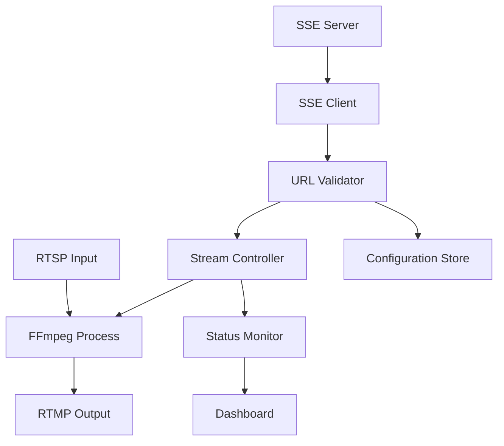

# Dynamic Streaming System - Product Requirements Document

## 1. Product Overview
A real-time streaming management system that dynamically receives RTSP input and RTMP output URLs via Server-Sent Events (SSE) and automatically manages FFmpeg streaming processes.
The system enables remote control of streaming configurations without manual intervention, allowing for flexible camera source switching and destination management.
Target market includes surveillance systems, live streaming platforms, and IoT camera management solutions requiring dynamic stream routing.

## 2. Core Features

### 2.1 User Roles
| Role | Registration Method | Core Permissions |
|------|---------------------|------------------|
| System Administrator | Direct system access | Full control over streaming configuration, SSE server management |
| Stream Manager | API key authentication | Can update stream URLs via SSE, monitor stream status |
| Viewer | Read-only access | Can view stream status and logs |

### 2.2 Feature Module
Our dynamic streaming system consists of the following main components:
1. **SSE Client Module**: Real-time event listening, URL reception, connection management.
2. **Stream Controller**: FFmpeg process management, stream lifecycle control, error handling.
3. **Configuration Manager**: URL validation, stream parameter management, fallback configurations.
4. **Monitoring Dashboard**: Stream status display, performance metrics, error logs.
5. **API Gateway**: RESTful endpoints for manual configuration, health checks.

### 2.3 Page Details
| Page Name | Module Name | Feature description |
|-----------|-------------|---------------------|
| Dashboard | Stream Status Monitor | Display current stream status, active URLs, connection health, performance metrics |
| Dashboard | Control Panel | Start/stop streaming, manual URL override, emergency controls |
| Configuration | URL Management | Validate and test RTSP/RTMP URLs, configure stream parameters, set fallback options |
| Configuration | SSE Settings | Configure SSE server endpoint, authentication, reconnection policies |
| Logs | Event History | Display SSE events, URL changes, stream restarts, error messages |
| Logs | Performance Metrics | Show bandwidth usage, stream quality, uptime statistics |
| Settings | System Configuration | Configure FFmpeg parameters, logging levels, notification settings |
| Settings | Security | Manage API keys, SSL certificates, access controls |

## 3. Core Process

**System Administrator Flow:**
1. Configure SSE server endpoint and authentication
2. Set initial RTSP and RTMP URLs as fallback
3. Configure FFmpeg streaming parameters
4. Start the streaming service
5. Monitor system health and performance

**Stream Manager Flow:**
1. Send new URL configurations via SSE
2. Monitor stream status changes
3. Receive confirmation of URL updates
4. Handle error notifications

**Automated System Flow:**
1. Listen for SSE events continuously
2. Validate received URLs
3. Gracefully stop current stream
4. Start new stream with updated URLs
5. Report status back via SSE or API

## 4. User Interface Design

### 4.1 Design Style
- **Primary Colors**: Dark blue (#1a365d) for headers, green (#38a169) for active status
- **Secondary Colors**: Gray (#718096) for inactive elements, red (#e53e3e) for errors
- **Button Style**: Rounded corners with subtle shadows, flat design with hover effects
- **Font**: Inter or system fonts, 14px base size, 16px for headers
- **Layout Style**: Card-based dashboard with sidebar navigation, responsive grid layout
- **Icons**: Feather icons for consistency, status indicators with color coding

### 4.2 Page Design Overview
| Page Name | Module Name | UI Elements |
|-----------|-------------|-------------|
| Dashboard | Stream Status | Real-time status cards with green/red indicators, animated connection status, bandwidth graphs |
| Dashboard | Control Panel | Large start/stop buttons, emergency stop (red), URL override input fields |
| Configuration | URL Management | Input validation with real-time feedback, test connection buttons, URL format helpers |
| Logs | Event History | Scrollable log viewer with filtering, color-coded message types, export functionality |
| Settings | System Config | Tabbed interface, form validation, save/reset buttons, configuration preview |

### 4.3 Responsiveness
Desktop-first design with mobile-adaptive layout. Touch-optimized controls for mobile devices, collapsible sidebar navigation, and responsive data tables with horizontal scrolling on smaller screens.