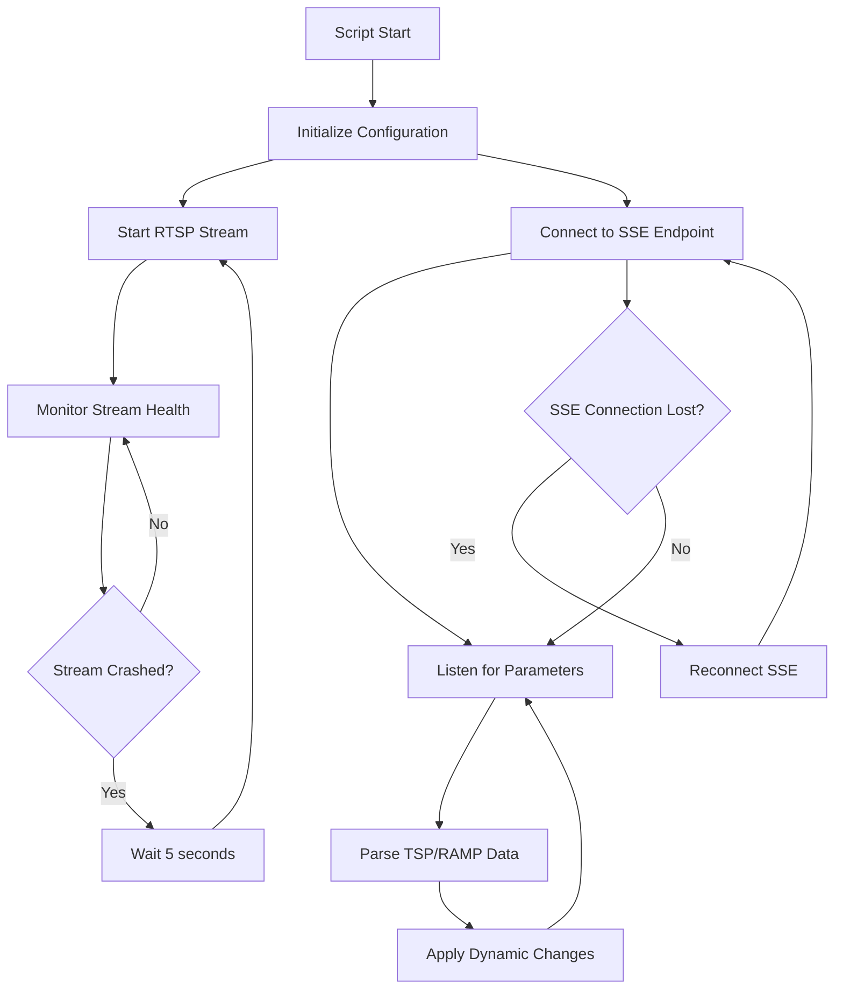

# RTSP Streaming with SSE Integration - Product Requirements Document

## 1. Product Overview
A robust shell script for Raspberry Pi that manages RTSP video streaming while dynamically adjusting parameters through Server-Sent Events (SSE) integration.

The script solves the problem of static streaming configurations by enabling real-time parameter adjustments without interrupting active streams, targeting content creators and streaming professionals who need adaptive streaming capabilities on resource-constrained devices.

## 2. Core Features

### 2.1 User Roles
| Role | Registration Method | Core Permissions |
|------|---------------------|------------------|
| System Administrator | Direct server access | Can configure streaming parameters, manage SSE endpoints, monitor system performance |
| Stream Operator | Command line access | Can start/stop streams, view logs, adjust basic parameters |

### 2.2 Feature Module
Our RTSP streaming solution consists of the following main components:
1. **Stream Management Interface**: Core streaming control, parameter configuration, status monitoring.
2. **SSE Parameter Control**: Real-time parameter reception, dynamic adjustment engine, connection management.
3. **System Monitoring Dashboard**: Performance metrics, error logging, resource usage tracking.
4. **Configuration Management**: Parameter validation, backup/restore, default settings.

### 2.3 Page Details
| Page Name | Module Name | Feature description |
|-----------|-------------|---------------------|
| Stream Management Interface | Core Streaming Control | Start/stop RTSP streams, configure ffmpeg parameters, monitor stream health |
| Stream Management Interface | Auto-restart Mechanism | Detect stream crashes, implement 5-second delay restart, maintain encoding settings |
| SSE Parameter Control | SSE Client Connection | Establish persistent SSE connection, handle connection failures, reconnect automatically |
| SSE Parameter Control | Parameter Parser | Parse TSP and RAMP values from SSE data, validate parameter ranges, apply changes dynamically |
| SSE Parameter Control | Dynamic Adjustment Engine | Modify ffmpeg parameters without stream interruption, queue parameter changes, handle conflicts |
| System Monitoring Dashboard | Performance Metrics | Track CPU/memory usage, monitor stream quality, log system events |
| System Monitoring Dashboard | Error Handling | Capture ffmpeg errors, log SSE connection issues, provide diagnostic information |
| Configuration Management | Parameter Validation | Validate TSP/RAMP ranges, check ffmpeg compatibility, prevent invalid configurations |
| Configuration Management | Settings Persistence | Save current parameters, restore on restart, maintain configuration history |

## 3. Core Process

**System Administrator Flow:**
1. Configure initial streaming parameters and SSE endpoint
2. Start the streaming script with monitoring enabled
3. Monitor system performance and adjust resource allocation
4. Review logs and troubleshoot issues as needed

**Stream Operator Flow:**
1. Execute the streaming script with predefined configuration
2. Monitor stream status through console output
3. Observe dynamic parameter adjustments from SSE feed
4. Restart or stop streams as required

**Automated System Flow:**
1. Initialize RTSP stream with current parameters
2. Establish SSE connection in parallel
3. Continuously monitor both stream health and SSE data
4. Apply parameter changes dynamically when received
5. Handle failures with automatic recovery mechanisms

## 4. User Interface Design

### 4.1 Design Style
- **Primary Colors**: Terminal green (#00FF00) for success, red (#FF0000) for errors
- **Secondary Colors**: Yellow (#FFFF00) for warnings, cyan (#00FFFF) for information
- **Output Style**: Clean console-based interface with structured logging
- **Font**: Monospace terminal fonts for consistent alignment
- **Layout Style**: Command-line interface with clear status indicators and timestamps
- **Icons**: ASCII-based status indicators (✓, ✗, ⚠, ℹ)

### 4.2 Page Design Overview
| Page Name | Module Name | UI Elements |
|-----------|-------------|-------------|
| Stream Management Interface | Core Streaming Control | Console output with timestamps, color-coded status messages, parameter display tables |
| Stream Management Interface | Auto-restart Mechanism | Crash detection alerts, countdown timers, restart confirmation messages |
| SSE Parameter Control | SSE Client Connection | Connection status indicators, endpoint URL display, retry attempt counters |
| SSE Parameter Control | Parameter Parser | Real-time parameter value display, validation status, change confirmation logs |
| System Monitoring Dashboard | Performance Metrics | ASCII-based progress bars, resource usage percentages, uptime counters |
| System Monitoring Dashboard | Error Handling | Structured error messages, stack traces, diagnostic recommendations |
| Configuration Management | Parameter Validation | Input validation feedback, acceptable range displays, configuration summaries |

### 4.3 Responsiveness
The solution is designed for command-line interface on Raspberry Pi, optimized for SSH terminal access and local console interaction. No touch interface optimization required as it targets server-side deployment.